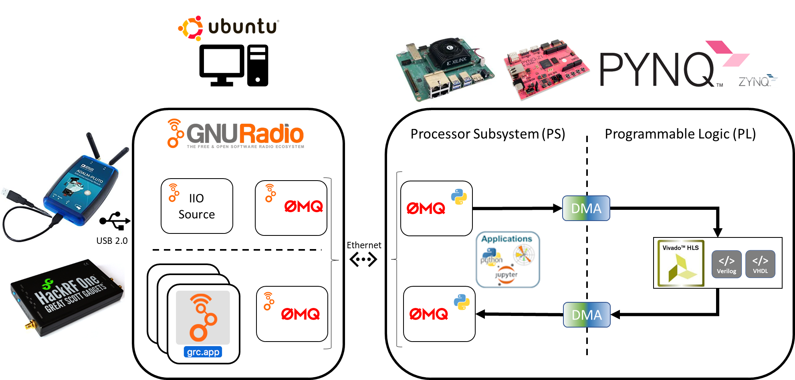

  

 
 
 

***puch*** is the glue logic between Analog Devices ADALM-Pluto SDR Evaluation board and the PYNQ Z1 FPGA development board with support from GNU Radio to provide a FPGA IP core development platform in wireless communications utilizing Xilinx Vivado HLS </> VHDL </> Verilog register transfer language (RTL).

 
 

 
 
 

## References

[Ubuntu 18.04 LTE - IOS Image File Download](http://old-releases.ubuntu.com/releases/18.04.4/ubuntu-18.04-desktop-amd64.iso)

[Xilinx Vivado v2019.1 Install Download File](https://www.xilinx.com/member/forms/download/xef-vivado.html?filename=Xilinx_Vivado_SDK_2019.1_0524_1430.tar.gz)

[Xilinx Vivado HLS v2019.1 HSL Documentation](https://www.xilinx.com/support/documentation/sw_manuals/xilinx2019_1/ug902-vivado-high-level-synthesis.pdf)

[Analog Devices ADALM-Pluto SDR](https://wiki.analog.com/university/tools/pluto/users)

[PYNQ v2.5](https://pynq.readthedocs.io/en/v2.5/)

[PYNQ Z1 FPGA Development Board](https://reference.digilentinc.com/programmable-logic/pynq-z1/reference-manual?redirect=1)

[ZeroMQ Python](https://zeromq.org/languages/python/)

[GNU Radio](https://www.gnuradio.org/)

[PyBOMBS](https://github.com/gnuradio/pybombs)

