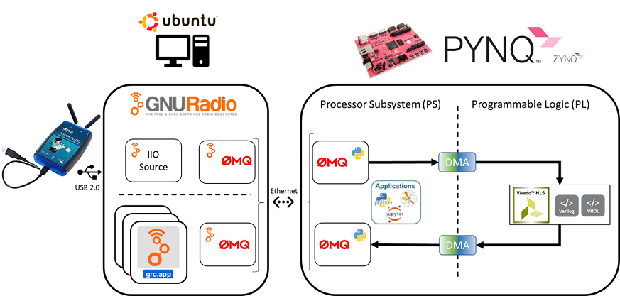

  

 
 
 

***puch*** is a framework the glue logic between Analog Devices ADALM-Pluto SDR Evaluation board and the PYNQ Z1 FPGA development board with support from GNU Radio to provide a platform for communications Xilinx HLS </> VHDL </> Verilog IP core development.

 
 

