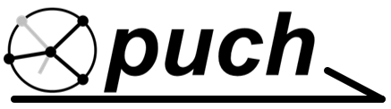

***puch*** is a framework that provides the glue logic between Analog Device Pluto SDR with support from GNU Radio and the PYNQ Z1 FPGA development platform to support communications Xilinx HLS IP core development.

