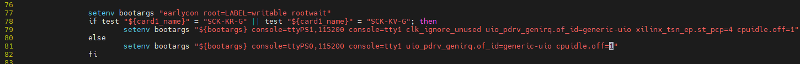
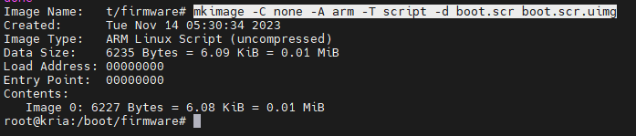
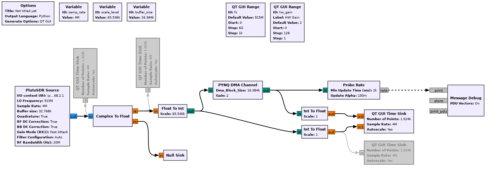
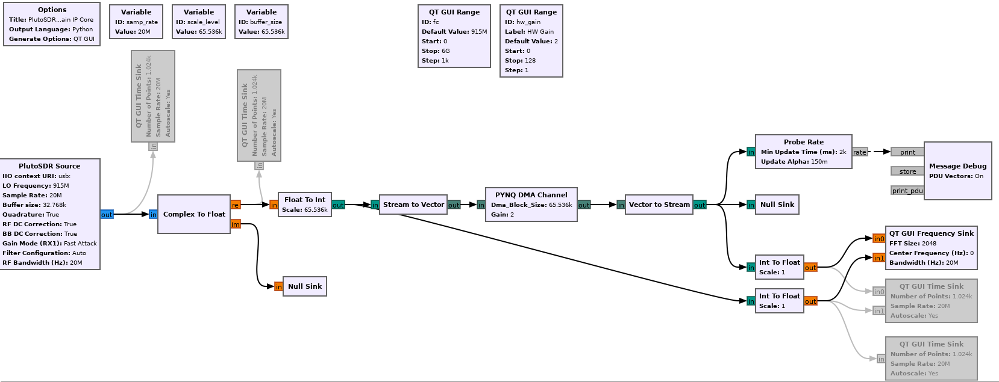
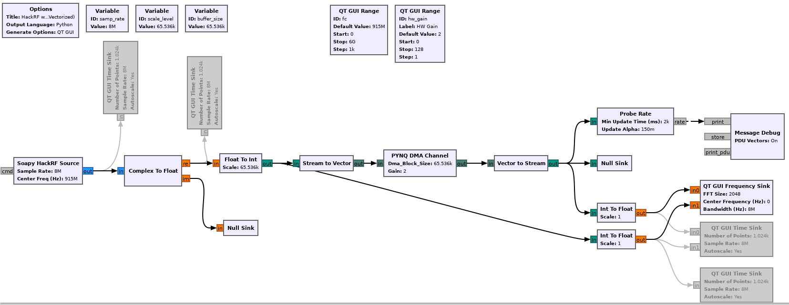
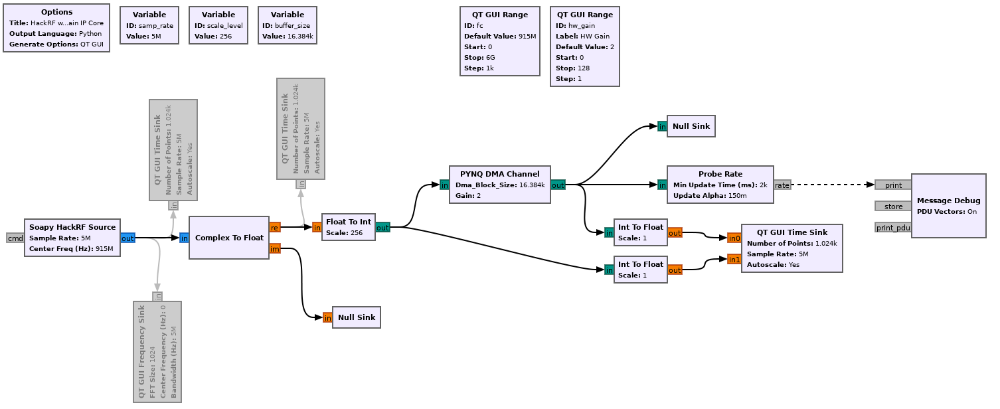

# Board Bring-up for KR260

[TOC]

All the information for setting up Kria KR260 is on [Confluence Site](https://xilinx-wiki.atlassian.net/wiki/spaces/A/pages/1641152513/Kria+SOMs+Starter+Kits)


# Create an SD Card Image

## Download K26 Ubuntu 22.04 Image

```http
https://ubuntu.com/download/amd-xilinx
```

Burn the Ubuntu 22.04 image to a SD Card.  Bot the board, then update the Kria Boot FW image.


## Download the Updated Kria Boot FW Image

```http
https://www.xilinx.com/member/forms/download/design-license-xef.html?filename=BOOT-k26-starter-kit-20230516185703.bin
```


## Install Boot FW Image to the Kria

Transfer the *.bin file to KR260 device and install by executing the following command:

```bash
sudo xmutil bootfw_update -i BOOT-k26-starter-kit-20230516185703.bin
```


## Configure the time zone

```bash
sudo timedatectl set-timezone America/Los_Angeles
```


# Create 512MB swap memory 

```bash
swapon --show
sudo sudo swapoff -a
sudo dd if=/dev/zero of=/swapfile bs=512 count=1048576
sudo chmod 600 /swapfile
sudo mkswap /swapfile
sudo swapon /swapfile
sudo free -h
```


# Install Kria PYNQ

```bash
git clone --recursive https://github.com/Xilinx/Kria-PYNQ.git
cd Kria-PYNQ
sudo bash install.sh -b KR260
```


## Issue with `apt-get update` after Kria PYNQ install

```bash
sudo vi /etc/apt/source.list.d/xilinx-gstreamer.list
```

Now comment the deb:

```sh
#deb http://ppa.launchpad.net/ubuntu-xilinx/updates/ubuntu jammy main
```


## Open Jupyter Lab

http://kria:9090/lab

### Manually Peek/Poke Register without Register Map

```python
IP_BASE_ADDRESS = 0x40000000
ADDRESS_RANGE = 0x1000
ADDRESS_OFFSET = 0x10

from pynq import MMIO
mmio = MMIO(IP_BASE_ADDRESS, ADDRESS_RANGE)

data = 0xdeadbeef
mmio.write(ADDRESS_OFFSET, data)
result = mmio.read(ADDRESS_OFFSET)
```


# Install GNU Radio

This will install GNU Radio 3.10.1.1.  Reference [[LINK](https://wiki.gnuradio.org/index.php/InstallingGR)]

```bash
sudo apt-get install gnuradio
```


# Running GNU Radio

Open browser and open Jupyter, then open terminal, and set PYTHONPATH.  More [information](https://wiki.gnuradio.org/index.php/ModuleNotFoundError).

```bash
export PYTHONPATH=/usr/local/share/pynq-venv/lib/python3.10/site-packages:$PYTHONPATH
export PYTHONPATH=/usr/local/share/pynq-venv/bin/pynq:$PYTHONPATH
export DISPLAY=192.168.1.78:10.0
```

Source PYNQ  Python3 to use in GNU Radio

```bash
sudo -i source /etc/profile.d/pynq_venv.sh python3
```

### GNU Radio Python References

Python Block with Vectors: https://wiki.gnuradio.org/index.php?title=Python_Block_with_Vectors

PySDR: https://pysdr.org/index.html


# Setup Samba Shared Folder

Install and configure `samba`

```bash
sudo apt install samba
sudo vi /etc/samba/smb.conf
```

Paste the following text into the `smb.conf` file:

```bash
[share]
    comment = Kria Shared Folder
    path = /home
    browsable = yes
    guest ok = yes
    read only = no
    create mask = 0755
```


# Disable `cpuidle` 

Resource: [Using Distro Boot with Xilinx U-Boot](https://xilinx-wiki.atlassian.net/wiki/spaces/A/pages/749142017/Using+Distro+Boot+With+Xilinx+U-Boot)

We want to use ILA to debug the FPGA image, therefore we will need to disable `cpuidle` to prevent the ARM processor to halt.  These are the sets to update the boot image to disable cpuidle.

Currently, we can work around this issue by adding "cpuidle.off=1" to bootargs. Bootargs is defined in "boot.scr.uimg" file in sd card first partition. We can extract it plain ASCII text format, edit it, and package it again. Here is the steps:

1. Boot the board, then use the SSH or Console to modify the `boot.scr.uimg` directly on the SD card

```bash
cd /boot/firmware
sudo -s
```

2. Now you want to unpack the `boot.scr.uimg` to source:

```bash
tail -c+73 < boot.scr.uimg > boot.scr
```

3.  Now edit the file, and add the `cpuidle.off=1` to the bootargs line:

```bash
vi /boot/firmware/boot.scr
```



4. Now rebuild the `boot.scr.uimg`:

```bash
mkimage -C none -A arm -T script -d boot.scr boot.scr.uimg
```



The boot log on the console should now have `cpuidle.off=1` 

```bash
[    0.000000] Kernel command line:  earlycon root=LABEL=writable rootwait console=ttyPS1,115200 console=tty1 clk_ignore_unused uio_pdrv_genirq.of_id=generic-uio xilinx_tsn_ep.st_pcp=4 cpuidle.off=1 cma=1000M
```


# Setting up PlutoSDR

Resource: https://wiki.analog.com/university/tools/pluto/drivers/linux


When you install GNU Radio 3.10.1.1, then PlutoSDR is already installed.  Now you just need to install libiio-utils

```bash
sudo apt install libiio-utils
```

Now verify the PlutoSDR can be probed

```bash
iio_info -u 'usb:'
-OR-
iio_info -u 'ip:192.168.2.1'
```

If you have issues finding the PlutoSDR, then run the search command

```bash
iio_info -s
```

This user name/password: `root`/`analog`

Use IP Address `192.168.2.1` for SSH

Use IP Address `192.168.2.10` for GNU Radio, IIO, etc.

##### `iio_info` Example

```bash
ubuntu@kria:~$ iio_info -s
Library version: 0.23 (git tag: v0.23)
Compiled with backends: local xml ip usb
Available contexts:
        0: (ina260, ams on ZynqMP SMK-K26 Rev1/B/A) [local:]
        1: 0456:b673 (Analog Devices Inc. PlutoSDR (ADALM-PLUTO)), serial=104400b83991000b0f0005003ed3642008 [usb:3.5.5]
        2: 192.168.2.1 (Analog Devices PlutoSDR Rev.B (Z7010-AD9364)), serial=104400b83991000b0f0005003ed3642008 [ip:PlutoSdr.local]
```

Now run either of the commands:

```bash
iio_info -u 'usb:3.5.5'
-OR-
iio_info -u 'ip:PlutoSdr.local'
```


# GNU Radio with PlutoSDR using an FPGA Gain Block IP Core


### Stream Implementation



### Vectorized Implementation




# Performance

#### Vectorized Implementation

| Metric              | HackRF                                                       | PlutoSDR |
| ------------------- | ------------------------------------------------------------ | -------- |
|                     |                                                              |          |
| HW Gain IP Core DMA | 4MSPS, no over flows.  GRC Modules: Probe Rate, 2-ch Time Sink |          |
| HW Gain IP Core DMA | 5MSPS,  no over flows.  GRC Modules: Probe Rate              |          |
| HW Gain IP Core DMA | 6MSPS,  no flows.  GRC Modules: Probe Rate, 2-ch Time Sink   |          |
| HW Gain IP Core DMA | 7MSPS,  no flows.  GRC Modules: Probe Rate, 2-ch Time Sink   |          |
| HW Gain IP Core DMA | 8MSPS,  over flows.  GRC Modules: Probe Rate, 2-ch Time Sink (only when 2-ch Time Sink) |          |
| Spectrum Plot       | 10MSPS, no over flows.  GRC Modules: Probe Rate, Frequency Spectrum Plot |          |

##### HackRF GRC Flowgraph - Vectorized Interface




#### Stream Implementation

| Metric              | HackRF                                                       | PlutoSDR |
| ------------------- | ------------------------------------------------------------ | -------- |
| HW Gain IP Core DMA | 4MSPS, no over flows.  GRC Modules: Probe Rate, 2-ch Time Sink |          |
| HW Gain IP Core DMA | 5MSPS,  over flows.  GRC Modules: Probe Rate (only when plotting) |          |
| HW Gain IP Core DMA | 6MSPS,  over flows.  GRC Modules: Probe Rate, 2-ch Time Sink |          |
| HW Gain IP Core DMA | 8MSPS,  over flows.  GRC Modules: Probe Rate, 2-ch Time Sink |          |
| Spectrum Plot       | 10MSPS, no over flows.  GRC Modules: Probe Rate, Frequency Spectrum Plot |          |

##### HackRF GRC Flowgraph - Stream Interface




# Backup SD Card

[PiShrink](https://github.com/Drewsif/PiShrink/tree/master)

# References

- GNU Radio Architecture Brief [[LINK](https://gnuradio-fr-19.sciencesconf.org/data/pages/gnuRadioArchitecture.pdf)]
- PySDR [[LINK](https://pysdr.org/index.html)]
- Creating Python OOT with `gr-modtool` for GNU Radio c3.10.1.1 (version on Kr260 board) [[LINK](https://wiki.gnuradio.org/index.php?title=Creating_Python_OOT_with_gr-modtool)]
  - Types of Blocks [[LINK](https://wiki.gnuradio.org/index.php?title=Types_of_Blocks)]
- Embedded Python Block [[LINK](https://wiki.gnuradio.org/index.php/Embedded_Python_Block#:~:text=Both%20the%20Embedded%20Python%20Block,that%20is%20embedded%20into%20flowgraphs.)]
  - Creating Your First Block [[LINK](https://wiki.gnuradio.org/index.php?title=Creating_Your_First_Block)]
  - Python Block with Vectors [[LINK](https://wiki.gnuradio.org/index.php?title=Python_Block_with_Vectors)]
  - Streams and Vectors [[LINK](https://wiki.gnuradio.org/index.php?title=Streams_and_Vectors)]
  - Python Block Message Passing [[LINK](https://wiki.gnuradio.org/index.php?title=Python_Block_Message_Passing)]
  - Python Guide [[LINK](https://wiki.gnuradio.org/index.php/Guided_Tutorial_GNU_Radio_in_Python)]
  - Python forecast [[LINK](https://stackoverflow.com/questions/68289222/gnu-radio-buffer-size)]
- Understanding Buffer Size [[LINK](https://stackoverflow.com/questions/68289222/gnu-radio-buffer-size)]
- Probe Rate [[LINK](https://wiki.gnuradio.org/index.php/Probe_Rate)]
- KR260 PMOD Pinout [[LINK](https://www.hackster.io/whitney-knitter/rpi-pmod-connector-gpio-with-custom-pl-design-in-kria-kr260-53c40e)]
