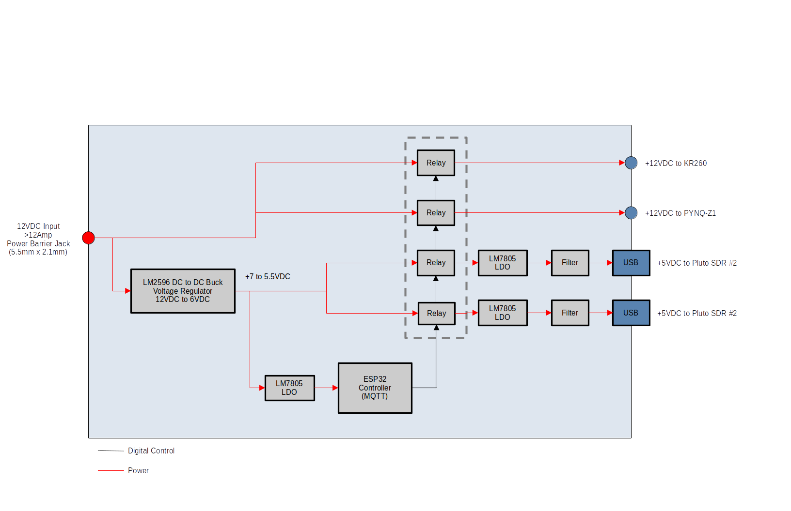

# Future Upgrades

## Front-Panel Modification

- Need to glue down the SMA Keystone jacks 

## Power Module

- Create a custom PCB to remotely control the power input for KR260, PYNQ-Z1, and both Pluto SDRs 
- Single 12VDC power supply will source power to all 4 devices
- Add clean external power to both Pluto SDRs (minimum ripple noise)
- Integration to Home Assistant via MQTT device
- Utilize already existing parts in my stock :)

