# Overview

I wanted a clean way to store 3 SDRs, 2 FPGA Boards, and a development computer while enabling easy access to interconnect all the devices together.  The solution is a 10" mini rack from GeekPi.  This way I can connect the SDR to the development computer USB port or the FPGA board (KR260 or PYNQ-Z1).  All ports of the devices are cabled to Keystone patch panel.

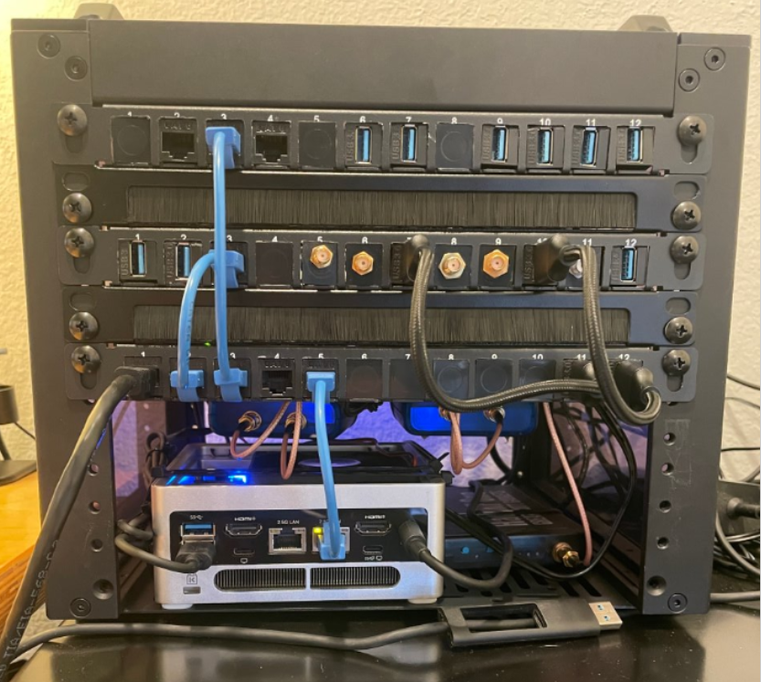

## Device Mounting Drawings

All drawings are to size to that were created to help determine if this would be a good solution to my problem.  Below is how all the devices are mounted in the GeekPi 10" mini-rack and how the devices are connected to the front panel.

### Front Panel

Currently I have the bottom half of the rack open to access the computer ports.  Based on how the devices are mounted, the HackRF is showing.

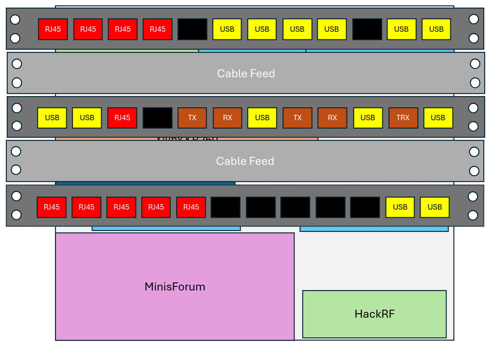

### Device Mounting - Front View

The PlutoSDR 1 & 2 are zipped tied to the second shelf.  All devices are secured in the mini-rack with zip-ties.

### Device Mounting - Side View

I am using the GeekPi 10" Plus, then purchased the GeekPi 10" normal shelfs to provide space (about 1 inch) for routing cables to the Keystone patch panels.

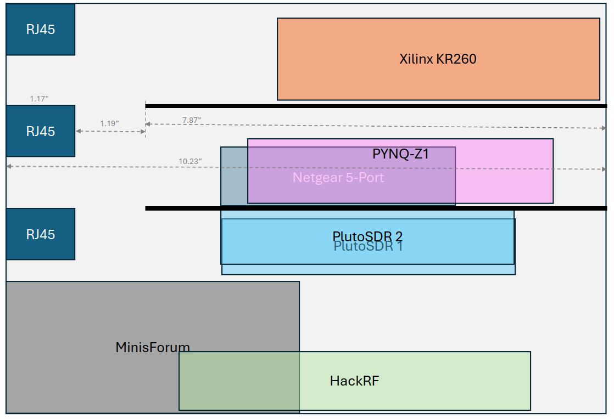

## Patch Panel Connection Drawings

### Row 1 Patch Panel Device Connections

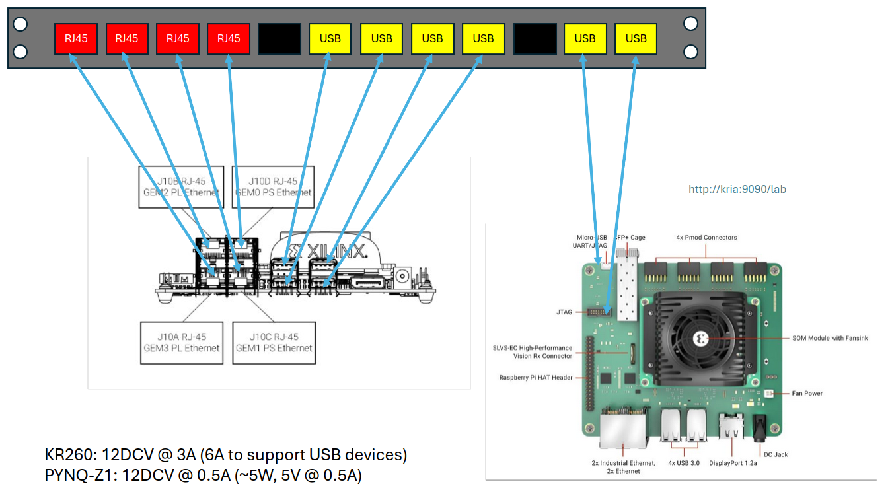

### Row 2 Patch Panel Device Connections

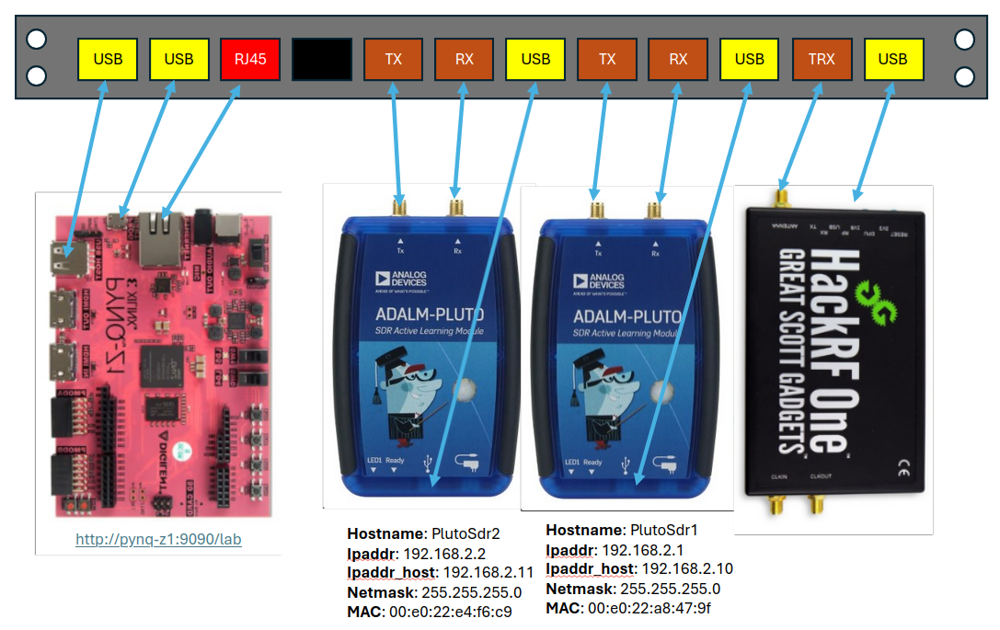

### Row 3 Patch Panel Device Connections

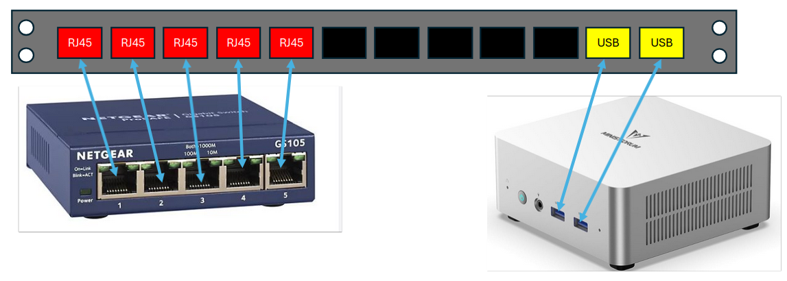

## Constructing the *puch* 10" Mini-Rack

Installed the SDRs (3) with development computer and secured the devices using zip-ties.

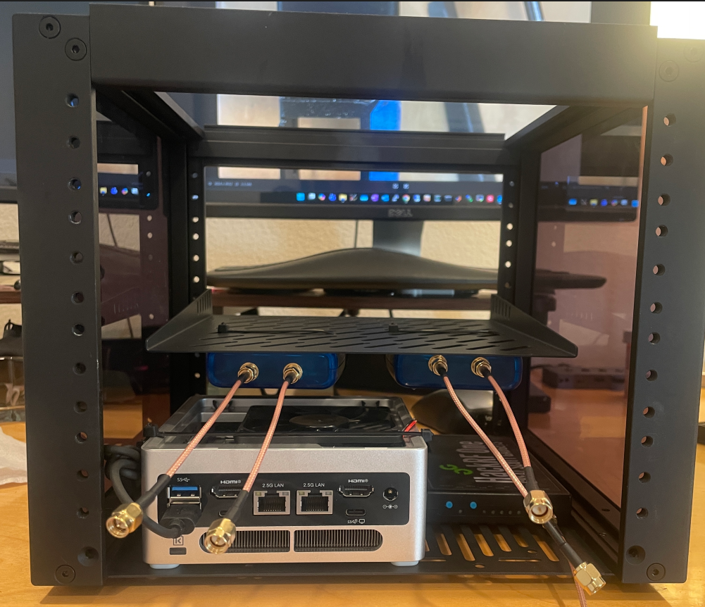

More devices installed with some cables:

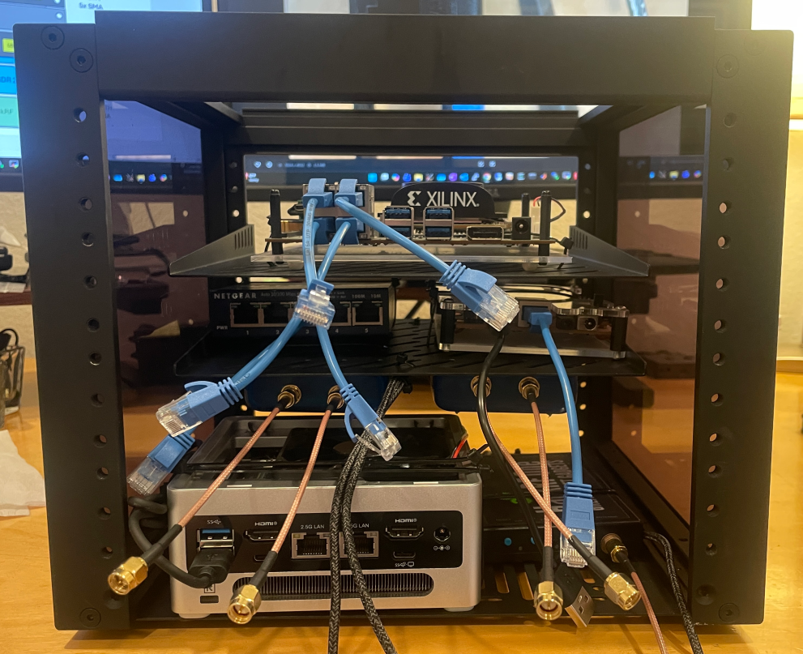

Side view:

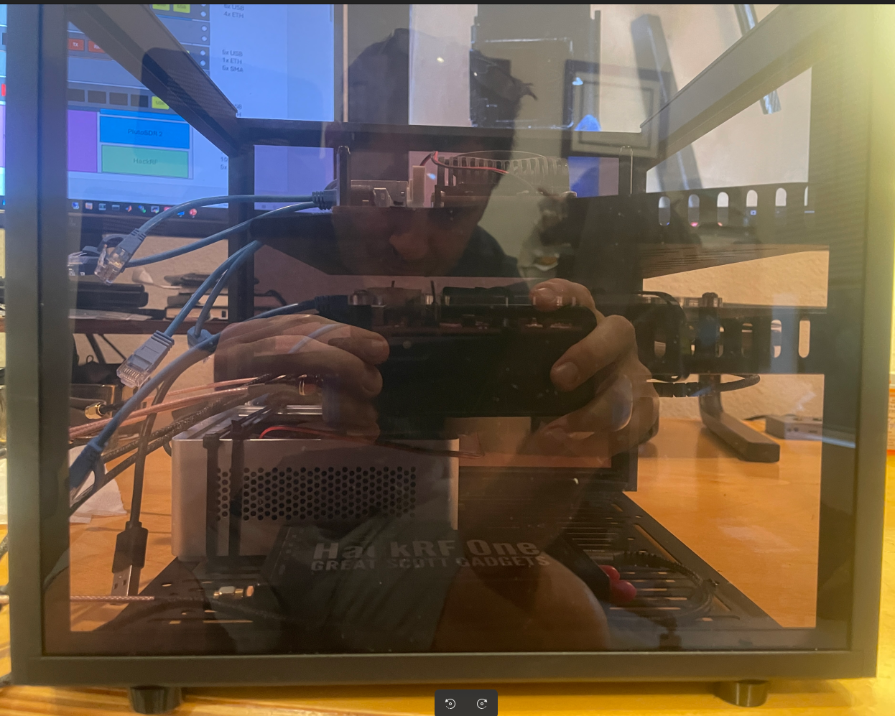

Rear view:

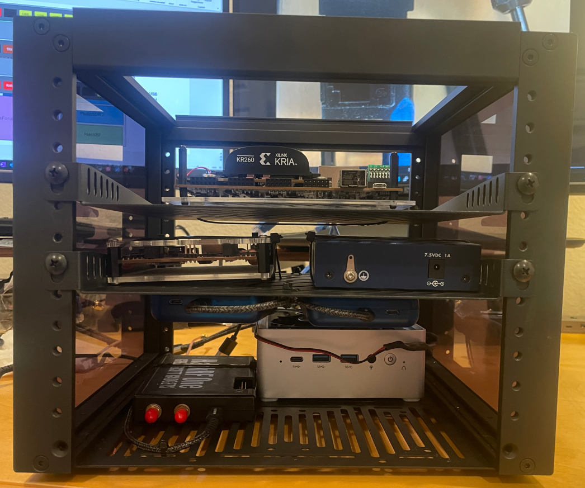

Installed a fan in the computer to ensure the NVMe drive stays cool while in the rack:

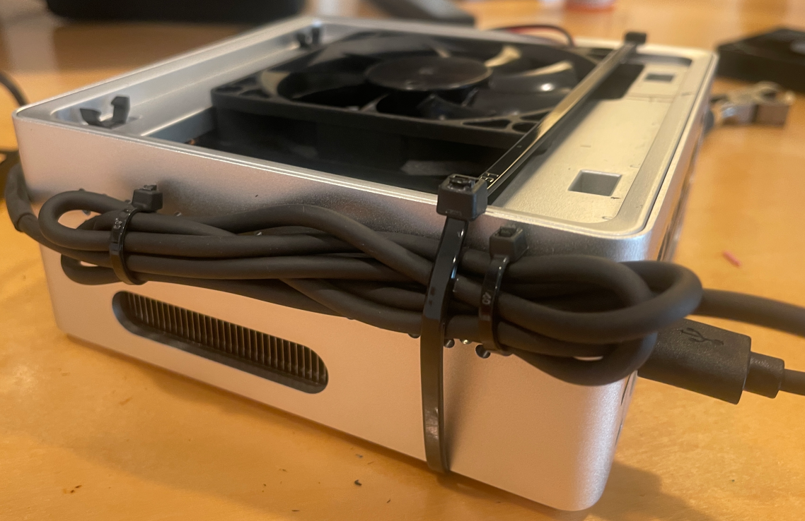

### Keystone Patch Panel Modification

The GeekPi 10 inch Keystone patch panel opening needed to be filed down about 2mm for the Ethernet and USB Keystone jacks to fit.  I didn't think this would take that long, but it took about 4 hours to modify all 36 Keystone openings for the three patch panels.  Though the final product turned out to fit the Ethernet and USB Keystone jacks:

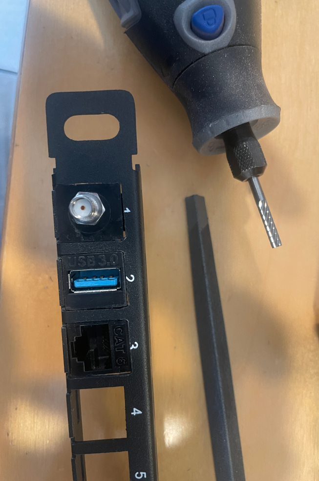

