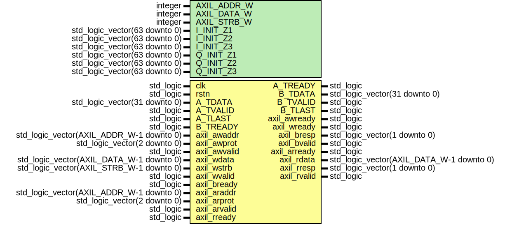

# Entity: gng_top 
- **File**: gng_top.vhd

## Diagram

## Generics

| Generic name | Type                          | Value               | Description |
| ------------ | ----------------------------- | ------------------- | ----------- |
| AXIL_ADDR_W  | integer                       | 8                   |             |
| AXIL_DATA_W  | integer                       | 32                  |             |
| AXIL_STRB_W  | integer                       | 4                   |             |
| I_INIT_Z1    | std_logic_vector(63 downto 0) | x"6094bc1bd3d8db9a" |             |
| I_INIT_Z2    | std_logic_vector(63 downto 0) | x"d36035b0ca17e666" |             |
| I_INIT_Z3    | std_logic_vector(63 downto 0) | x"e2d0b140ab8ac10b" |             |
| Q_INIT_Z1    | std_logic_vector(63 downto 0) | x"bc6840786a43d19a" |             |
| Q_INIT_Z2    | std_logic_vector(63 downto 0) | x"4756b3c2f33b8c9f" |             |
| Q_INIT_Z3    | std_logic_vector(63 downto 0) | x"32b439953f41c5e7" |             |

## Ports

| Port name    | Direction | Type                                     | Description |
| ------------ | --------- | ---------------------------------------- | ----------- |
| clk          | in        | std_logic                                |             |
| rstn         | in        | std_logic                                |             |
| A_TDATA      | in        | std_logic_vector(31 downto 0)            |             |
| A_TVALID     | in        | std_logic                                |             |
| A_TLAST      | in        | std_logic                                |             |
| A_TREADY     | out       | std_logic                                |             |
| B_TDATA      | out       | std_logic_vector(31 downto 0)            |             |
| B_TVALID     | out       | std_logic                                |             |
| B_TLAST      | out       | std_logic                                |             |
| B_TREADY     | in        | std_logic                                |             |
| axil_awaddr  | in        | std_logic_vector(AXIL_ADDR_W-1 downto 0) |             |
| axil_awprot  | in        | std_logic_vector(2 downto 0)             |             |
| axil_awvalid | in        | std_logic                                |             |
| axil_awready | out       | std_logic                                |             |
| axil_wdata   | in        | std_logic_vector(AXIL_DATA_W-1 downto 0) |             |
| axil_wstrb   | in        | std_logic_vector(AXIL_STRB_W-1 downto 0) |             |
| axil_wvalid  | in        | std_logic                                |             |
| axil_wready  | out       | std_logic                                |             |
| axil_bresp   | out       | std_logic_vector(1 downto 0)             |             |
| axil_bvalid  | out       | std_logic                                |             |
| axil_bready  | in        | std_logic                                |             |
| axil_araddr  | in        | std_logic_vector(AXIL_ADDR_W-1 downto 0) |             |
| axil_arprot  | in        | std_logic_vector(2 downto 0)             |             |
| axil_arvalid | in        | std_logic                                |             |
| axil_arready | out       | std_logic                                |             |
| axil_rdata   | out       | std_logic_vector(AXIL_DATA_W-1 downto 0) |             |
| axil_rresp   | out       | std_logic_vector(1 downto 0)             |             |
| axil_rvalid  | out       | std_logic                                |             |
| axil_rready  | in        | std_logic                                |             |

## Signals

| Name           | Type                                       | Description |
| -------------- | ------------------------------------------ | ----------- |
| rst            | std_logic                                  |             |
| awgn_gain      | std_logic_vector(F_AWGN.tBits-1 downto 0)  |             |
| awgn_enable    | std_logic                                  |             |
| I_gng          | std_logic_vector(F_AWGN.tBits-1 downto 0)  |             |
| Q_gng          | std_logic_vector(F_AWGN.tBits-1 downto 0)  |             |
| I_gng_d        | std_logic_vector(F_AWGN.tBits-1 downto 0)  |             |
| Q_gng_d        | std_logic_vector(F_AWGN.tBits-1 downto 0)  |             |
| B_TVALID_int   | std_logic                                  |             |
| B_TLAST_int    | std_logic                                  |             |
| B_TDATA_int    | std_logic_vector(2*F_OUT.tBits-1 downto 0) |             |
| tlast_pipe     | std_logic_vector(0 to DLY-1)               |             |
| ch_I_sat       | std_logic                                  |             |
| ch_Q_sat       | std_logic                                  |             |
| ch_I           | std_logic_vector(F_OUT.tBits-1 downto 0)   |             |
| ch_Q           | std_logic_vector(F_OUT.tBits-1 downto 0)   |             |
| cnt_tvalid     | std_logic_vector(31 downto 0)              |             |
| cnt_tvalid_cap | std_logic_vector(31 downto 0)              |             |
| cnt_tlast      | std_logic_vector(31 downto 0)              |             |
| cnt_tlast_cap  | std_logic_vector(31 downto 0)              |             |
| clr_cnt        | std_logic                                  |             |
| cap_cnt        | std_logic                                  |             |

## Constants

| Name   | Type    | Value                                       | Description |
| ------ | ------- | ------------------------------------------- | ----------- |
| F_AWGN | format  | (16, 11) |             |
| F_IN   | format  | (16, 12) |             |
| F_OUT  | format  | (16, 12) |             |
| DLY    | natural | 1                                           |             |

## Processes
- unnamed: ( clk,B_TREADY,rst )
- unnamed: ( clk )

## Instantiations

- U_AWGN_REG: work.awgn_reg
- u_gng_I: work.gng
- u_gng_Q: work.gng
- U_GAIN_AWGN_I: work.Mult
- U_GAIN_AWGN_Q: work.Mult
- U_ADD_AWGN_I: work.Add
- U_ADD_AWGN_Q: work.Add
