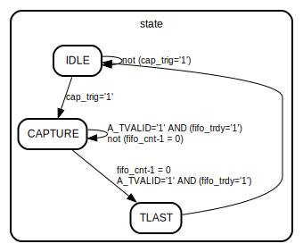

# Entity: DMA_Data_Capture_Top 
- **File**: DMA_Data_Capture_Top.vhd

## Diagram

## Generics

| Generic name | Type    | Value | Description |
| ------------ | ------- | ----- | ----------- |
| AXIL_ADDR_W  | integer | 8     |             |
| AXIL_DATA_W  | integer | 32    |             |
| AXIL_STRB_W  | integer | 4     |             |

## Ports

| Port name    | Direction | Type                                     | Description |
| ------------ | --------- | ---------------------------------------- | ----------- |
| clk          | in        | std_logic                                |             |
| rstn         | in        | std_logic                                |             |
| A_TDATA      | in        | std_logic_vector(31 downto 0)            |             |
| A_TVALID     | in        | std_logic                                |             |
| A_TREADY     | out       | std_logic                                |             |
| B_TDATA      | out       | std_logic_vector(31 downto 0)            |             |
| B_TVALID     | out       | std_logic                                |             |
| B_TLAST      | out       | std_logic                                |             |
| B_TREADY     | in        | std_logic                                |             |
| B_TKEEP      | out       | std_logic_vector(3 downto 0)             |             |
| axil_awaddr  | in        | std_logic_vector(AXIL_ADDR_W-1 downto 0) |             |
| axil_awprot  | in        | std_logic_vector(2 downto 0)             |             |
| axil_awvalid | in        | std_logic                                |             |
| axil_awready | out       | std_logic                                |             |
| axil_wdata   | in        | std_logic_vector(AXIL_DATA_W-1 downto 0) |             |
| axil_wstrb   | in        | std_logic_vector(AXIL_STRB_W-1 downto 0) |             |
| axil_wvalid  | in        | std_logic                                |             |
| axil_wready  | out       | std_logic                                |             |
| axil_bresp   | out       | std_logic_vector(1 downto 0)             |             |
| axil_bvalid  | out       | std_logic                                |             |
| axil_bready  | in        | std_logic                                |             |
| axil_araddr  | in        | std_logic_vector(AXIL_ADDR_W-1 downto 0) |             |
| axil_arprot  | in        | std_logic_vector(2 downto 0)             |             |
| axil_arvalid | in        | std_logic                                |             |
| axil_arready | out       | std_logic                                |             |
| axil_rdata   | out       | std_logic_vector(AXIL_DATA_W-1 downto 0) |             |
| axil_rresp   | out       | std_logic_vector(1 downto 0)             |             |
| axil_rvalid  | out       | std_logic                                |             |
| axil_rready  | in        | std_logic                                |             |

## Signals

| Name          | Type                          | Description |
| ------------- | ----------------------------- | ----------- |
| state         | state_type                    |             |
| fifo_tdata    | std_logic_vector(31 downto 0) |             |
| fifo_tvalid   | std_logic                     |             |
| fifo_tlast    | std_logic                     |             |
| fifo_trdy     | std_logic                     |             |
| fifo_cnt      | unsigned(31 downto 0)         |             |
| cap_depth     | std_logic_vector(31 downto 0) |             |
| cap_trig      | std_logic                     |             |
| fifo_flush    | std_logic                     |             |
| fifo_flush_n  | std_logic                     |             |
| debug_cnt_en  | std_logic                     |             |
| fifo_wr_ptr   | std_logic_vector(15 downto 0) |             |
| fifo_rd_ptr   | std_logic_vector(15 downto 0) |             |
| fifo_wr_ptr32 | std_logic_vector(31 downto 0) |             |
| fifo_rd_ptr32 | std_logic_vector(31 downto 0) |             |
| rst           | std_logic                     |             |

## Enums

### *state_type*
| Name    | Description |
| ------- | ----------- |
| IDLE    |             |
| CAPTURE |             |
| TLAST   |             |

## Processes
- unnamed: ( clk,rstn,fifo_flush )

## Instantiations

- U_DMA_DATA_CAPTURE_REG: work.dma_data_capture_reg
- U_DMA_32B_CAPTURE_FIFO: DMA_32b_Capture_FIFO

## State machines

