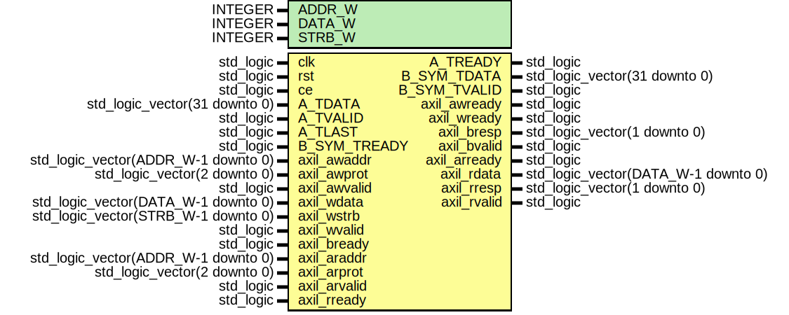

# Entity: QPSK_Demod_Top 
- **File**: QPSK_Demod_Top.vhd

## Diagram

## Generics

| Generic name | Type    | Value | Description |
| ------------ | ------- | ----- | ----------- |
| ADDR_W       | INTEGER | 8     |             |
| DATA_W       | INTEGER | 32    |             |
| STRB_W       | INTEGER | 4     |             |

## Ports

| Port name    | Direction | Type                                | Description |
| ------------ | --------- | ----------------------------------- | ----------- |
| clk          | in        | std_logic                           |             |
| rst          | in        | std_logic                           |             |
| ce           | in        | std_logic                           |             |
| A_TDATA      | in        | std_logic_vector(31 downto 0)       |             |
| A_TVALID     | in        | std_logic                           |             |
| A_TREADY     | out       | std_logic                           |             |
| A_TLAST      | in        | std_logic                           |             |
| B_SYM_TDATA  | out       | std_logic_vector(31 downto 0)       |             |
| B_SYM_TVALID | out       | std_logic                           |             |
| B_SYM_TREADY | in        | std_logic                           |             |
| axil_awaddr  | in        | std_logic_vector(ADDR_W-1 downto 0) |             |
| axil_awprot  | in        | std_logic_vector(2 downto 0)        |             |
| axil_awvalid | in        | std_logic                           |             |
| axil_awready | out       | std_logic                           |             |
| axil_wdata   | in        | std_logic_vector(DATA_W-1 downto 0) |             |
| axil_wstrb   | in        | std_logic_vector(STRB_W-1 downto 0) |             |
| axil_wvalid  | in        | std_logic                           |             |
| axil_wready  | out       | std_logic                           |             |
| axil_bresp   | out       | std_logic_vector(1 downto 0)        |             |
| axil_bvalid  | out       | std_logic                           |             |
| axil_bready  | in        | std_logic                           |             |
| axil_araddr  | in        | std_logic_vector(ADDR_W-1 downto 0) |             |
| axil_arprot  | in        | std_logic_vector(2 downto 0)        |             |
| axil_arvalid | in        | std_logic                           |             |
| axil_arready | out       | std_logic                           |             |
| axil_rdata   | out       | std_logic_vector(DATA_W-1 downto 0) |             |
| axil_rresp   | out       | std_logic_vector(1 downto 0)        |             |
| axil_rvalid  | out       | std_logic                           |             |
| axil_rready  | in        | std_logic                           |             |

## Signals

| Name             | Type                          | Description |
| ---------------- | ----------------------------- | ----------- |
| ap_start         | std_logic                     |             |
| ap_done          | std_logic                     |             |
| ap_idle          | std_logic                     |             |
| demod_bits_stb   | std_logic                     |             |
| demod_bits       | std_logic_vector( 1 downto 0) |             |
| demod_bits_stb_q | std_logic                     |             |
| demod_bits_q     | std_logic_vector( 1 downto 0) |             |
| BRAM_wr_addr     | std_logic_vector(15 downto 0) |             |
| BRAM_wr_addr_clr | std_logic                     |             |
| BRAM_rd_addr     | std_logic_vector(15 downto 0) |             |
| BRAM_rd_data     | std_logic_vector(31 downto 0) |             |
| shift_reg        | std_logic_vector(31 downto 0) |             |
| sync_word        | std_logic_vector(31 downto 0) |             |
| sync_lock        | std_logic                     |             |
| sync_clr         | std_logic                     |             |
| B_SYM_TDATA_i    | std_logic_vector(31 downto 0) |             |
| B_SYM_TVALID_i   | std_logic                     |             |

## Constants

| Name  | Type   | Value                                       | Description |
| ----- | ------ | ------------------------------------------- | ----------- |
| F_IN  | format | (16, 12) |             |
| F_OUT | format | (16, 12) |             |

## Processes
- unnamed: ( clk )
- unnamed: ( clk,rst,BRAM_wr_addr_clr )
- unnamed: ( clk,rst,sync_clr )

## Instantiations

- U_QPSK_REG: work.qpsk_reg
- U_QPSK_DEMOD: QPSK_Demodulator
- U_QPSK_DEMOD_OUT_BRAM: QPSK_Demod_Out_BRAM
